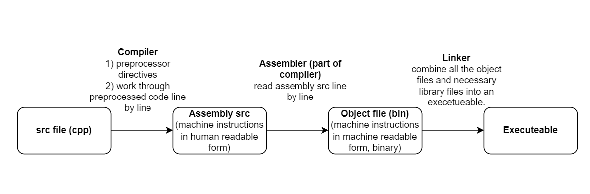

- [Compilation Process](#compilation-process)
- [2) Variables & Basic Types](#2-variables--basic-types)
  - [Literals](#literals)
  - [Variable](#variable)
  - [Compound Types](#compound-types)
  - [References](#references)
  - [Pointers](#pointers)
  - [Type Aliases - Opt1) typedef](#type-aliases---opt1-typedef)
  - [Type Aliases - Opt2) "using"](#type-aliases---opt2-using)
  - [decltype](#decltype)
  - [Defining our own data structures](#defining-our-own-data-structures)
  - [Writing out own header files](#writing-out-own-header-files)


# Compilation Process



# 2) Variables & Basic Types

* mixing unsigned and signed types can produce unexpected behaviour.
  
## Literals

```cpp
// char literal
'a'
// string literal
"hello"
// compiler always appends a null char '\0' to string literlas. 
// Hence, actual size of string literals is one more than apparrent.
```

## Variable

* declaration - introduce an identifier. It's what the **compiler** needs.
* definition- instantiate the identifier. It's what the **linker** needs.
```cpp
// extern keyword tells compiler that a var is defined in another source module.
extern int x;
```

## Compound Types

* compound types - a type that is defined in terms of another type. e.g. pointers & references.

## References
* references are not objects. It's another name for an already existing object.
* references must be initialised.
* references can't be rebinded.
```cpp
// & is the address of operator.
int x = 2;
int &ref = x;

ref += 1;
// prints 3.
cout << x;
// prints the addresses of x & ref, which are the same.
cout << &x << endl;
cout << &ref << endl;
```

## Pointers

* pointers ARE objects.
* pointers hold the address of another object.
* pointers do not have to be initialised.

```cpp
int x = 0;
// define the pointer. It 'points' to the address of x.
int *ptr = &x;

// 1) print the address of x.
cout << &x << endl;
// 2) print the address of x. 1 = 2.
cout << ptr << endl;
// 3) print the address of the pointer itself 3 != 1.
cout << &ptr << endl;
// 4) print the value of the memory address ,which is x = 0.
cout << *ptr << endl;
```

## Type Aliases - Opt1) typedef

* typedef allows us to use another name for a data type.

```cpp
// DOUB becomes a synonym for double
typedef double DOUB;
// the following two are now equivalent
double x;
DOUB x;
```

## Type Aliases - Opt2) "using"

```cpp
// DOUB becomes a synonym for double
using DOUB = double;
```

## decltype

* can use decltype() to define a var with a type that the compiler deduces from an expresion (but do not want to use that expression to init the variable)

```cpp
// the datatype of sum is whatever type that f() returns.
decltype(f()) sum;
```

## Defining our own data structures

* in cpp, we define our own data types by using classess/structs.
* The default accessability of member vars & methods in structs are public, in a class they are private.

```cpp
// example struct
struct Ice_Cream_Van{
unsigned double milk_pct = 20;
int sugar = 15;
std::string name;
};

// declaring a struct
Ice_Cream_Van korneto;
korneto.sugar = 30;
```

## Writing out own header files

* To ensure that class defs are the same in each file, classess are usually defined in header files. Typically, header names are derived from the name of the class within. 
* Since headers often need to use facilities from other headers, "double imports" can occur which lead to errors. **header guards** come to save the day. 
* every '#' is read before anything else in the compilation process, by the preprocessor.
```cpp
// inside ice_cream_van.h
// 
#ifndef ICE
#define ICE
struct Ice_Cream_Van{
unsigned double milk_pct = 20;
int sugar = 15;
std::string name;
};
#endif
```
```cpp
// inside ice_cream_van.h
// Alternatively:
#pragma once
struct Ice_Cream_Van{
unsigned double milk_pct = 20;
int sugar = 15;
std::string name;
};
```